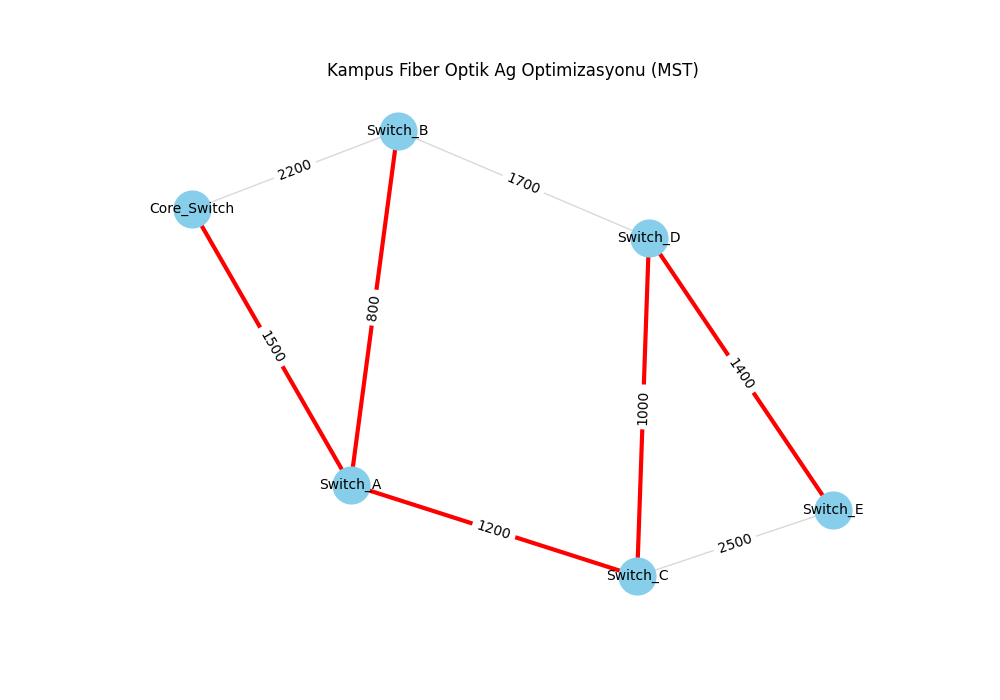

# Campus Fiber Optic Network Optimization

## 1. Real-World Problem Context
In modern Information Systems infrastructure, connecting multiple physical buildings or office branches to a central Data Center is a critical task. Laying physical medium (like fiber optic cables) involves high capital expenditure (CAPEX) due to labor, excavation, and material costs. This project simulates a campus network environment where a main Core Switch needs to be connected to 5 edge switches located in different buildings.

## 2. Problem Definition
The primary objective of this project is to connect all the edge switches (Switch_A to Switch_E) to the central Core Switch (Data Center) minimizing the total cabling cost. Direct connections from the core to every single building are geographically challenging and financially inefficient. Therefore, the goal is to find the optimal network topology that ensures full connectivity with the lowest possible total installation cost without creating unnecessary loops.

## 3. Network Model
This problem is formulated as a **Minimum Spanning Tree (MST)** problem. 
* A spanning tree connects all vertices together.
* A *minimum* spanning tree is a spanning tree with weight less than or equal to the weight of every other spanning tree. This ensures the total cost of laying the fiber optic cables is minimized.

## 4. Nodes and Edges
* **Nodes (6):** Represent the networking equipment in the campus. 
  * `Core_Switch` (Data Center)
  * `Switch_A`, `Switch_B`, `Switch_C`, `Switch_D`, `Switch_E` (Office Buildings)
* **Edges (8):** Represent the possible fiber optic cable routes between the buildings.
* **Weights:** Represent the cost of laying the cable in USD (`Cost_USD`). 

## 5. Selected Algorithm
The project utilizes **Kruskal's Algorithm** (via NetworkX's `minimum_spanning_tree` function). Kruskal's algorithm finds a minimum spanning forest of an undirected edge-weighted graph. It works by sorting all the edges from the lowest weight to the highest and iteratively adding the lowest cost edge to the tree, provided it does not form a cycle.

## 6. Python Implementation
The solution was developed using Python with the following libraries:
* `pandas`: Used for reading the hypothetical network data from a `.csv` file (`network_data.csv`) and managing the data frame.
* `networkx`: Used for creating the graph structure, adding nodes/edges, and computing the Minimum Spanning Tree mathematically.
* `matplotlib.pyplot`: Used for generating a visual representation of the network, highlighting the selected optimal paths in red and unselected potential paths in gray.

## 7. Results
The algorithm successfully found the optimal network topology.
* **Total Possible Cost (If all cables were laid):** 12,300 USD
* **Minimum Spanning Tree Cost:** 5,900 USD

**Selected Optimal Connections:**
* Switch_A to Switch_B: 800 USD
* Switch_C to Switch_D: 1000 USD
* Switch_A to Switch_C: 1200 USD
* Switch_D to Switch_E: 1400 USD
* Core_Switch to Switch_A: 1500 USD



## 8. Managerial Interpretation
From a management perspective, optimizing IT infrastructure costs is just as important as the technology itself. By applying the Minimum Spanning Tree model to our campus network design, we avoided deploying an inefficient "star topology" where every building is directly wired to the core. 

For instance, a direct connection between the Core Switch and Switch_B would cost 2,200 USD. However, our model identified that routing the connection through Switch_A provides the same network access for a combined cost of only 2,300 USD (1500 + 800), while simultaneously connecting Switch_A to the network.

**ROI and Savings:** If we had laid fiber across all possible paths without optimization, the infrastructure cost would have been 12,300 USD. By relying on this data-driven optimization, we achieved full campus connectivity for only 5,900 USD, resulting in a **capital saving of 52% (6,400 USD)**. This saved budget can be reallocated to purchasing better core routers or strengthening the cybersecurity defense lines of the campus.

## 9. How to Run the Code
To replicate this project on your local machine, follow these steps:

1. Clone the repository to your local machine.
2. Install the required Python dependencies:
   ```bash
   pip install -r requirements.txt